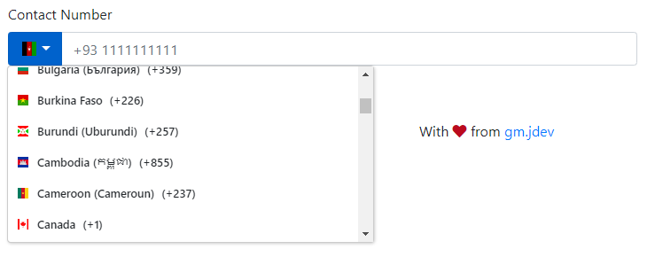

# gm-tel-input

An Angular based module providing support for international mobile number input along with validation support using [google-libphonenumber](https://www.npmjs.com/package/google-libphonenumber). Component styling is based on [Bootstrap](https://github.com/twbs/bootstrap).  



## Installation

#### Install the package via `npm`:

```sh
npm install --save gm-tel-input
```

Install library dependencies

```sh
npm install --save jquery
npm install --save bootstrap
npm install --save flag-icon-css
npm install --save google-libphonenumber
```

## Usage
Add and import ```GmTelInputModule``` module into application

```javascript
import { GmTelInputModule } from 'gm-tel-input';

imports: [
    GmTelInputModule.forRoot()
]
```

Add following code snippet required to render element in your HTML file
```html
<gm-tel-input [value]="telNumber" [invalidFormatMsg]="'Invalid Contact number format'" 
    [invalidTelMsg]="'Invalid Contact number'" [formControlSrc]="telNumberCtrl" [id]="contactNbr">
</gm-tel-input>
```
Initialized Form Control and value to be used by component
```javascript
telNumberCtrl: FormControl = new FormControl('', []);
telNumber = {};
```

If you are interested to have basic phone number validation based on [google-libphonenumber](https://www.npmjs.com/package/google-libphonenumber), kindly import `phoneNumberValidator` from `gm-tel-input` library and update ```FormControl``` initialization definition as below :
```javascript
telNumberCtrl: FormControl = new FormControl('', [phoneNumberValidator()]);
```

Add following CSS and Script files to your **`angular.json`** file

```json
"styles": [
  "node_modules/flag-icon-css/css/flag-icon.min.css",
  "node_modules/bootstrap/dist/css/bootstrap.min.css"
],
"scripts": [
  "node_modules/jquery/dist/jquery.min.js",
  "node_modules/bootstrap/dist/js/bootstrap.bundle.js"
]
```

## Options

| Options          | Type              | Default                                      | Description                                                |
| ---------------- | ----------------- | -------------------------------------------- | ---------------------------------------------------------- |
| value            | ```object```      | {<br>countryCode:'',<br>mobileNumber:''<br>} | Object containing selected country code and mobile number. |
| invalidFormatMsg | ```string```      | ```''```                                     | Validation error message for invalid input format.         |
| invalidTelMsg    | ```string```      | ```''```                                     | Validation error message for incorrect input number.       |
| formControlSrc   | ```FormControl``` |                                              | Instance of ```FormControl``` to be used                   |
| id               | ```string```      | contactNbr                                   | Id to be used in native HTML input element                 |

## Tests
Coming up

## Acknowledgments / Attributions
- Country & Flag images from [flag-icon-css](https://github.com/lipis/flag-icon-css) 
- Contact Number validation from [google-libphonenumber](https://www.npmjs.com/package/google-libphonenumber)
- Theme and Styling with help of [Bootstrap](https://github.com/twbs/bootstrap)

## Support

If you like this library consider to add star on [GitHub Repository](https://github.com/gmjdev/gm-tel-input).

Thank you!

## Licenses

Copyright 2019 gm.jdev@gmail.com

Licensed under the Apache License, Version 2.0 (the "License");
you may not use this file except in compliance with the License.
You may obtain a copy of the License at

    http://www.apache.org/licenses/LICENSE-2.0

Unless required by applicable law or agreed to in writing, software
distributed under the License is distributed on an "AS IS" BASIS,
WITHOUT WARRANTIES OR CONDITIONS OF ANY KIND, either express or implied.
See the License for the specific language governing permissions and
limitations under the License.